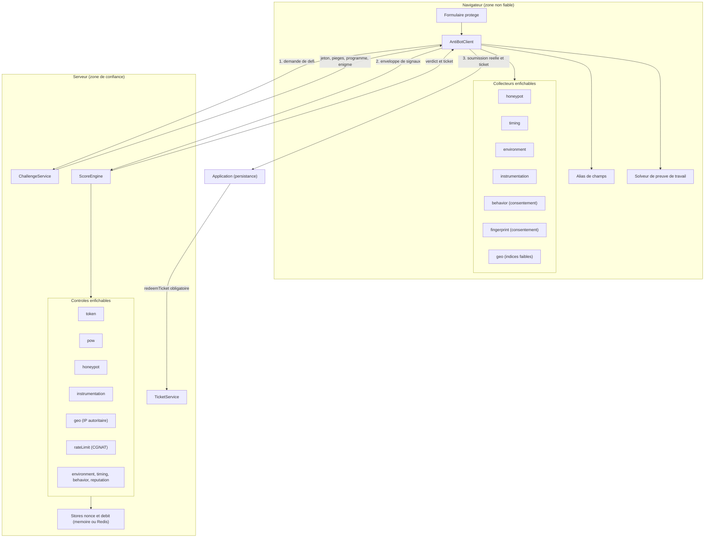
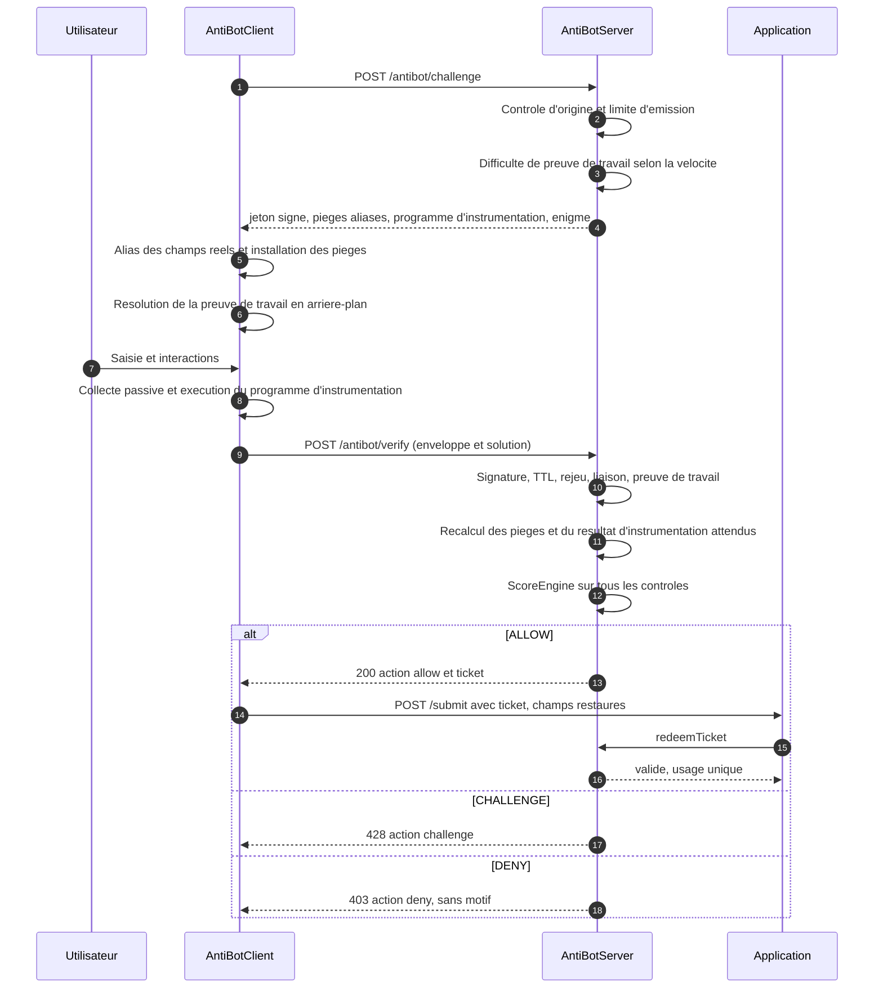
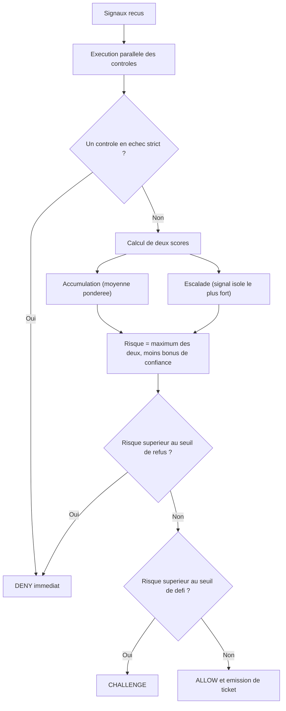

# AMIELIGIBLE

Alternative auto-hebergee aux CAPTCHA (reCAPTCHA, Cloudflare Turnstile,
hCaptcha) pour la protection anti-bot et anti-spam des formulaires web, sans
aucune dependance externe. Le serveur utilise uniquement `node:crypto` et
`node:http`, le navigateur uniquement WebCrypto. Le client et le serveur sont
reunis dans un seul depot.

Fonctions principales : noms de champs aliases par session, pieges dynamiques,
analyse temporelle, empreinte d'appareil, entropie comportementale, detection
d'automatisation, module d'instrumentation anti-retro-ingenierie, preuve de
travail adaptative (SHA-256 ou RSW), jetons de defi signes anti-rejeu, tickets
d'autorisation a usage unique, limitation de debit consciente du CGNAT, mode
deception, rotation de cles HMAC, et filtre d'eligibilite par pays configurable.

## Alternative aux CAPTCHA hebergees

AMIELIGIBLE remplace reCAPTCHA, Cloudflare Turnstile ou hCaptcha pour la
protection des formulaires, sans envoyer le trafic de vos utilisateurs a un
tiers. Il s'auto-heberge, ne fait aucun appel reseau vers un service externe, et
garde l'ensemble des donnees sur votre infrastructure. C'est un point concret
pour un service algerien : aucune dependance a une plateforme etrangere qui peut
etre lente ou filtree, et une conformite plus simple avec la loi 18-07.

| Critere | reCAPTCHA / Turnstile / hCaptcha | AMIELIGIBLE |
| --- | --- | --- |
| Hebergement | service tiers | votre infrastructure |
| Appel reseau vers un tiers | oui | aucun |
| Donnees utilisateur envoyees a un tiers | oui | aucune |
| Experience | invisible ou puzzle selon le score | invisible par defaut, second facteur au besoin |
| Eligibilite par pays integree | non | oui |
| Cout | gratuit puis payant a volume | libre, MIT |
| Dependances | script distant | aucune |

Le compromis a connaitre : une CAPTCHA hebergee beneficie d'un reseau de
renseignement inter-sites que cette bibliotheque n'a pas. AMIELIGIBLE ne voit
que votre propre trafic. Il compense par la defense en profondeur decrite
ci-dessous et par la limitation de debit, et il se combine sans difficulte avec
un second facteur (code par SMS ou par courriel) pour les cas a risque.

## Principe de conception

Aucun code JavaScript execute dans le navigateur ne peut arreter a lui seul un
robot determine, car tout ce qui s'execute cote client peut etre lu, modifie ou
rejoue. L'architecture en tient compte :

1. Le client se contente de collecter des indices. Il ne prend aucune decision.
2. Le serveur decide. Chaque signal client est traite comme une donnee non
   fiable, purement consultative.
3. L'eligibilite geographique est etablie cote serveur a partir de l'adresse IP,
   jamais a partir du fuseau horaire ou de la langue du navigateur.
4. Chaque decision est explicable. Un detail par controle est produit pour les
   journaux d'audit, et uniquement pour ces journaux.

## Architecture







Une moyenne ponderee seule dilue un signal accablant. Le terme d'escalade
permet a un controle isole de forte confiance d'emporter la decision.

## Couches de defense

| Couche | Role | Propriete |
| --- | --- | --- |
| Jeton de defi signe | falsification, rejeu, reutilisation, soumission trop rapide | nonce a usage unique, trousseau HMAC avec rotation |
| Tickets d'autorisation | robots publiant directement sur la persistance | ticket obligatoire, usage unique, lie a l'IP et au contenu soumis, courte duree |
| Alias de champs par session | detection des champs reels et des pieges | noms reels et pieges rendus indistinguables et aleatoires par session |
| Pieges derives par session | robots connaissant les pieges, rejeu de charges | noms et sentinelle derives du nonce, recalcules cote serveur |
| Module d'instrumentation | analyse statique, rejeu d'un solveur fige | programme different a chaque session, verifie cote serveur, detection d'alteration |
| Preuve de travail adaptative | economie du spam | SHA-256 ou enigmes RSW sequentielles, difficulte scellee et croissante |
| Reponses sans motif | oracle de diagnostic | le robot n'apprend jamais la raison d'un blocage |
| Mode deception | iteration de l'attaquant | faux succes, tickets fantomes, ralentissement |
| Garde d'origine et limite d'emission | recolte de jetons | origine non conforme refusee, emission limitee |
| Limites conscientes du CGNAT | inondations | seuils larges par IP, stricts par empreinte |
| Eligibilite geographique | pays non autorises, anonymiseurs | resolveur enfichable, mode refus ou signalement |

## Alias de champs

Les champs reels du formulaire recoivent un nom aleatoire propre a chaque
session. Les pieges recoivent des noms suivant le meme schema. Un robot qui
analyse le formulaire voit un ensemble de champs aux noms aleatoires et ne peut
plus distinguer les champs reels des pieges, ni s'appuyer sur des noms connus.
Les champs reels sont declares par un attribut `data-fld` :

```html
<input data-fld="email" type="email" />
```

Le client remplace le nom par un alias au chargement, reconstruit les valeurs
canoniques pour la verification, puis restaure les noms canoniques juste avant
la soumission autorisee et retire les pieges du formulaire.

## Liaison du ticket au contenu soumis

Un ticket ne se contente pas d'attester qu'une verification a reussi, il atteste
que ce contenu precis a ete verifie. Lorsque les donnees du formulaire sont
transmises a `handleVerify`, le ticket emis integre une empreinte HMAC de ces
donnees, calculee sur une representation canonique ou les cles sont triees.

Au moment de la persistance, `redeemTicket` recoit les champs recus et compare
les empreintes. Un robot qui obtiendrait un ticket avec un contenu anodin puis
soumettrait une charge differente est refuse avec le motif
`ticket_payload_mismatch`. La liaison est facultative et retrocompatible : si
aucune donnee n'est fournie, le ticket reste valide sur les autres criteres.

```js
const decision = await antibot.handleVerify({ envelope, ip, formId, formData });
const verdict = antibot.redeemTicket(ticket, { formId, ip, formData: champs });
```

## Module d'instrumentation et anti-retro-ingenierie

A chaque session, le serveur derive du nonce un petit programme d'operations
(un bytecode) et calcule le resultat attendu. Le programme est transmis au
client, qui l'execute au moyen d'une machine virtuelle minimale, puis renvoie le
resultat et le temps d'execution. Le serveur compare au resultat attendu.

Cette approche apporte trois garanties :

1. La logique de verification n'est pas exprimee en clair dans le code source,
   mais sous forme de donnees qui changent a chaque session. L'analyse statique
   d'une session capturee ne revele pas d'algorithme fixe.
2. Un resultat correct prouve que le client a reellement execute le programme de
   la session, ce qui neutralise le rejeu d'un solveur fige.
3. Le collecteur verifie l'integrite des fonctions natives et signale toute
   alteration. Un temps d'execution anormalement long est egalement signale.

Un resultat faux provoque un echec strict. Un resultat manquant est traite comme
un risque eleve plutot que comme un blocage definitif, afin de ne pas exclure un
navigateur ancien. La longueur du programme est fixee par la configuration du
serveur et non par le client : une longueur declaree differente est refusee avec
le motif `instr_length_mismatch`, ce qui empeche de reduire le travail demande.

## Distribution du client

Le client existe en deux formes. La forme modulaire (`src/client/index.js`)
s'integre a une chaine de build existante (esbuild, Vite, webpack). La forme
autonome (`src/client/standalone.js`) est un fichier unique sans import qui
s'inclut directement par une balise `script`, sans etape de build.

Le code client est volontairement lisible et n'est pas obscurci. L'obscurcissement
cote navigateur ne constitue pas une protection : tout code execute dans le
navigateur peut etre lu et modifie. La garantie de securite est etablie cote
serveur, ou chaque signal est verifie et ou la decision est prise. Pour reduire
la taille du fichier livre, passez la forme autonome dans le minifieur de votre
choix lors du deploiement.

## Performance

Mesures obtenues avec `npm run bench` sur Node 24, un seul thread, resolveur
geographique en memoire.

| Operation | Debit | Latence |
| --- | --- | --- |
| Emission de defi | environ 32 000 par seconde | |
| Verification complete (pipeline entier) | environ 13 000 par seconde | p50 0,06 ms, p99 0,16 ms |
| Verification de preuve de travail (serveur) | environ 650 000 par seconde | |
| Verification de la trappe RSW (serveur) | environ 90 000 par seconde | |
| Generation de la paire de cles RSW (une fois) | | environ 8 ms |

Cout de resolution de la preuve de travail, cote navigateur, un seul thread :
environ 11 ms a 12 bits et environ 50 ms a 16 bits. Ce cout est paye une fois
par le visiteur et se calcule en arriere-plan pendant la saisie, sans blocage de
l'interface.

Choix qui expliquent ces chiffres :

- Le moteur execute tous les controles en parallele. La latence correspond au
  controle le plus lent, non a leur somme.
- Le resultat du resolveur geographique est mis en cache par IP.
- La preuve de travail est resolue en arriere-plan et cede la main a l'interface.
- Les stores en memoire nettoient leurs entrees de facon periodique et non a
  chaque appel, et plafonnent leur nombre de cles. La consommation memoire reste
  bornee meme sous un trafic compose d'adresses toutes differentes.
- La paire de cles RSW est generee une seule fois a la construction du serveur.

Une instance de client protege un formulaire. Pour proteger plusieurs
formulaires sur une meme page, instanciez un client par formulaire.

## Tests

```bash
npm test
```

La suite couvre, en unites et en integration, la signature et le rejeu des
jetons, les deux protocoles de preuve de travail, la machine virtuelle
d'instrumentation, l'agregation du moteur de score, la liaison des tickets au
contenu, l'eligibilite geographique, la limitation de debit consciente du CGNAT,
l'eviction des stores, et le parcours complet pour un humain, un robot, un pays
non eligible, un anonymiseur, un rejeu et une soumission trop rapide.

```bash
npm run bench
```

## Demarrage

```bash
npm test
```

```bash
node examples/server.js
```

Le premier execute la suite de tests. Le second lance la demonstration complete
sur `http://localhost:3000`, ou vous pouvez soumettre le formulaire et observer
les decisions dans les journaux du serveur.

## Configuration serveur

```js
import { AntiBotServer } from './src/server/index.js';

const antibot = new AntiBotServer({
  secret: process.env.ANTIBOT_SECRET,
  allowedOrigins: ['https://www.exemple.dz'],
  allowCountries: ['DZ', 'TN', 'FR'],
  geoMode: 'deny',
  blockAnonymizers: true,
  geoResolver: async (ip) => {
    const rec = geoip.get(ip);
    return { country: rec.country, isAnonymizer: rec.isVpn, asn: rec.asn };
  },
  pow: { enabled: true, protocol: 'sha256', baseDifficulty: 12, maxDifficulty: 18 },
  instrumentation: { enabled: true, length: 24, maxSolveMs: 250 },
  deception: { enabled: true, tarpitMs: 2500 },
  rateLimits: {
    ip: { windowMs: 60000, soft: 15, hard: 60 },
    fp: { windowMs: 60000, soft: 4, hard: 10 },
  },
  thresholds: { challengeAt: 45, denyAt: 75 },
});
```

### Eligibilite par pays

La liste d'autorisation est configurable par `allowCountries` (codes ISO 3166
alpha-2). Un visiteur dont le pays resolu ne figure pas dans cette liste est
traite selon `geoMode` : refuse en mode `deny`, ou seulement penalise en mode
`flag`. Pour un autre contexte, seule la configuration change, sans modification
du code :

```js
allowCountries: ['DZ', 'TN', 'FR'],
geoMode: 'deny',
```

### Rotation des cles

```js
keys: { v2: NOUVEAU_SECRET, v1: ANCIEN_SECRET },
activeKid: 'v2',
```

Les jetons emis sous une cle precedente restent verifiables pendant toute leur
duree de vie.

### Protocole de preuve de travail

```js
pow: { enabled: true, protocol: 'rsw', rswBits: 1024, rswBaseT: 30000 },
```

Le protocole `rsw` impose des elevations au carre sequentielles. Chaque etape
depend de la precedente, ce qui rend le parallelisme materiel sans effet. Le
serveur verifie instantanement grace a la trappe.

## Les trois points d'entree

```js
app.post('/antibot/challenge', (req, res) => {
  const out = antibot.handleChallenge({
    formId: 'inscription', ip: req.ip,
    ua: req.headers['user-agent'], origin: req.headers.origin,
  });
  res.status(out.status).json(out.error ? { error: out.error } : out);
});

app.post('/antibot/verify', async (req, res) => {
  const d = await antibot.handleVerify({
    envelope: req.body.envelope, ip: req.ip,
    ua: req.headers['user-agent'], origin: req.headers.origin,
    formId: 'inscription',
  });
  audit.log(d);
  setTimeout(() => res.status(d.public.status).json(d.public.body), d.tarpitMs);
});

app.post('/inscription', (req, res) => {
  const t = antibot.redeemTicket(req.body.antibot_ticket, {
    formId: 'inscription', ip: req.ip,
  });
  if (!t.ok) return res.status(403).end();
  if (t.shadow) return quarantaine(req.body), res.json({ ok: true });
  enregistrer(req.body);
  res.json({ ok: true });
});
```

L'appel a `redeemTicket` est essentiel. Sans lui, un robot ignore tout le
dispositif et publie directement sur le point de persistance.

## Configuration client

```js
import { AntiBotClient } from './src/client/index.js';

const client = new AntiBotClient({ formId: 'inscription' });
client.setConsent(true);

const minimal = new AntiBotClient({ formId: 'inscription', privacyMode: 'minimal' });

client.protect(document.querySelector('#inscription'), { autoIntercept: true });
```

Le consentement est desactive par defaut. Les collecteurs d'empreinte et de
comportement ne s'executent qu'apres `setConsent(true)`. Le mode
`privacyMode: 'minimal'` ne les instancie pas.

Pour un site sans etape de build, la forme autonome expose une fonction globale :

```html
<script src="/js/amieligible.standalone.js"></script>
<script>Amieligible.protect(document.querySelector('#inscription'), { formId: 'inscription' });</script>
```

## Conformite (loi 18-07 modifiee par la loi 25-11)

Ce document constitue une orientation technique et non un avis juridique. Il
convient de le confirmer avec un conseil et aupres de l'ANPDP.

La loi 18-07 definit la donnee personnelle de facon large, ce qui couvre les
adresses IP, les empreintes d'appareil et les profils comportementaux.

Ce que la bibliotheque met en oeuvre :

- Consentement prealable et explicite. Contrairement au RGPD, la loi ne prevoit
  pas de base d'interet legitime. Les collecteurs d'empreinte et de comportement
  sont donc desactives jusqu'a l'appel de `setConsent(true)`.
- Mode minimal, sans empreinte ni suivi comportemental ni cookie.
- Pseudonymisation des adresses IP dans les stores, actif par defaut.
- Resolution geographique a effectuer contre une base locale ou un en-tete
  fourni par votre CDN. Interroger une API etrangere constitue un transfert
  international encadre par les articles introduits par la loi 25-11.

Obligations du responsable de traitement :

| Obligation | Reference |
| --- | --- |
| Declaration ou autorisation prealable aupres de l'ANPDP | regime a deux niveaux |
| Designation d'un delegue a la protection des donnees | article 41 bis 1 |
| Notification de violation sous cinq jours | article 45 bis 8 |
| Analyse d'impact pour les traitements a risque eleve | article 45 bis 6 |
| Registre des traitements et journal des traitements automatises | articles 41 bis 2 et 3 |
| Information, acces, rectification sous dix jours, opposition | droits des personnes |
| Duree de conservation limitee des journaux contenant des IP | securite |

Les sanctions vont d'amendes de 20 000 a 1 000 000 DA a un emprisonnement de
deux mois a cinq ans, doubles en cas de recidive.

## Liste de controle avant production

- Secret aleatoire d'au moins 32 octets, issu d'un gestionnaire de secrets.
- `allowedOrigins` renseigne avec vos domaines reels.
- Stores memoire remplaces par Redis, indispensable a la protection anti-rejeu
  sur plusieurs instances.
- Resolveur geographique reel, en base locale.
- Extraction correcte de l'IP derriere un proxy de confiance.
- Second facteur reel branche sur le verdict de defi.
- Chaque point de persistance appelle `redeemTicket`.
- Interface de consentement branchee sur `setConsent`.
- Motifs et details envoyes aux journaux, jamais au client.
- Empreinte TLS au niveau du repartiteur de charge.
- Surveillance des faux positifs sur navigateurs prives et reseaux partages.

## Structure du depot

```
src/
  shared/      contrat de protocole, vocabulaire de risque, machine virtuelle
  client/      orchestrateur, collecteurs, solveur, transport, version autonome
  server/      moteur de score, controles, jetons, tickets, stores
test/          suite unitaire et d'integration (node:test)
bench/         mesure de debit et de latence
examples/
  server.js       demonstration complete sans dependance
  browser.html    integration navigateur
```

## Accessibilite

Les champs pieges conservent `aria-hidden` et `tabindex="-1"`. Les lecteurs
d'ecran ne les atteignent pas. Il s'agit d'un compromis assume en faveur de
l'accessibilite.

## Licence

MIT
